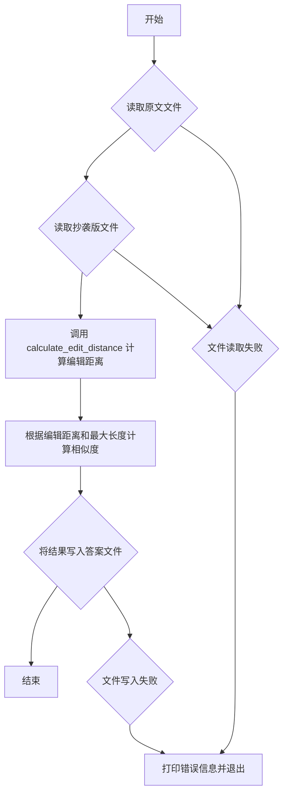
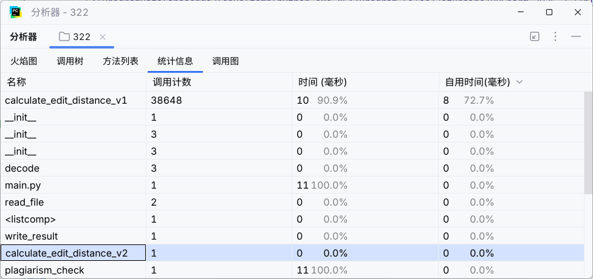
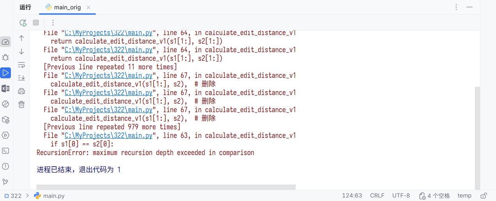
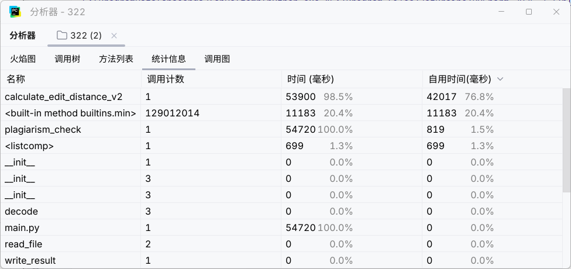
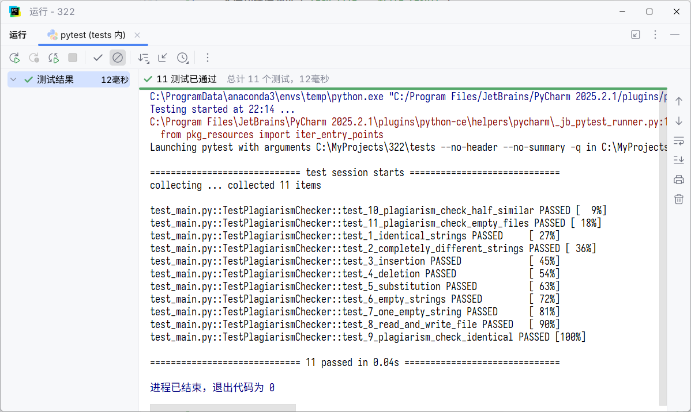
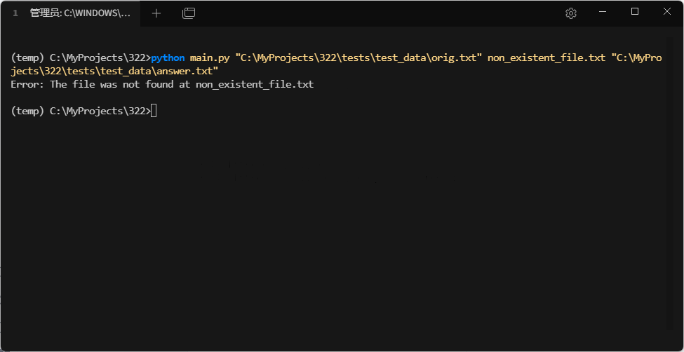
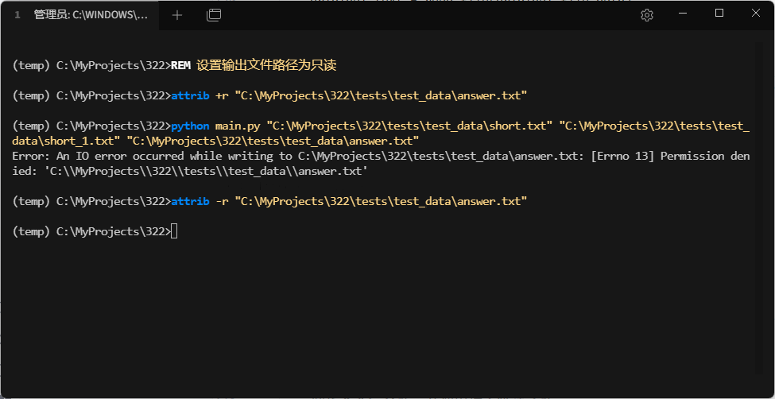
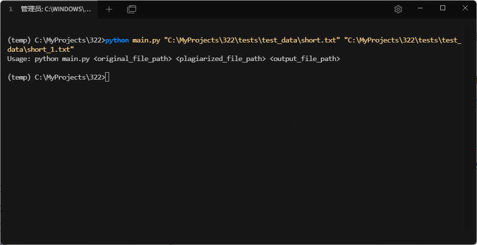

# 第一次个人编程作业

> github仓库链接：[aliyablat/3223004639](https://github.com/aliyablat/3223004639)

## PSP 2.1 表格

| PSP2.1 | Personal Software Process Stages | 预估耗时 (分钟) | 实际耗时 (分钟) |
| :--- | :--- | :--- | :--- |
| **Planning** | **计划** | **15** | **20** |
| Estimate | 估计这个任务需要多少时间 | (已包含在“计划”中) | (已包含在“计划”中) |
| **Development** | **开发** | **85** | **105** |
| Analysis | 需求分析 (包括学习新技术) | 20 | 25 |
| Design Spec | 生成设计文档 | 15 | 20 |
| Design Review | 设计复审 | 5 | 5 |
| Coding Standard | 代码规范 (为目前的开发制定合适的规范) | 5 | 5 |
| Design | 具体设计 | 10 | 15 |
| Coding | 具体编码 | 20 | 25 |
| Code Review | 代码复审 | 5 | 5 |
| Test | 测试 (自我测试、修改代码、提交修改) | 5 | 5 |
| **Reporting** | **报告** | **20** | **25** |
| Test Report | 测试报告 | 10 | 15 |
| Size Measurement | 计算工作量 | 5 | 5 |
| Postmortem & Process Improvement Plan | 事后总结, 并提出过程改进计划 | 5 | 5 |
| | **合计** | **120** | **150** |

## 设计与实现过程

### 计算模块接口设计

  - **`plagiarism_check(original_file_path: str, plagiarized_file_path: str, output_file_path: str)`**

      - **功能**: 核心业务函数，负责协调整个查重流程。
      - **参数**: 接收三个字符串参数，分别是原文路径、抄袭版论文路径和答案输出文件路径。
      - **内部流程**:
        1.  调用 `read_file` 函数分别读取原文和抄袭版论文的内容。
        2.  将读取到的文本内容传递给 `calculate_edit_distance_v2` 函数（优化后版本），计算它们之间的编辑距离。
        3.  根据编辑距离和文本长度计算相似度（重复率）。
        4.  调用 `write_result` 函数将计算出的相似度写入指定的输出文件。

  - **`calculate_edit_distance_v1(s1: str, s2: str) -> int` 和 `calculate_edit_distance_v2(s1: str, s2: str) -> int`**

      - **功能**: 算法核心，计算两个字符串之间的编辑距离（Levenshtein 距离）。
      - **参数**: 接收两个待比较的字符串 `s1` 和 `s2`。
      - **返回值**: 返回一个整数，即编辑距离。
      - **实现**: v1 版本采用纯递归方式实现；v2 版本采用动态规划方式实现，作为性能优化的关键。

  - **`read_file(file_path: str) -> str`** 和 **`write_result(similarity: float, output_path: str)`**

      - **功能**: 负责文件的读写操作，并包含了基本的异常处理逻辑。

### 算法原理

本项目的核心算法是**编辑距离 (Levenshtein Distance)**。编辑距离衡量的是将一个字符串转换成另一个字符串所需的最少单字符编辑（插入、删除或替换）次数。

例如，从 "cat" 到 "car"，需要替换 't' 为 'r'，编辑距离为 1。

v1版本实现采用的是一个经典的**递归**方法。其基本思想如下：

  - 如果一个字符串为空，则转换代价是另一个字符串的全部长度（通过插入操作）。
  - 如果两个字符串的第一个字符相同，则问题可以简化为计算剩下部分的编辑距离。
  - 如果两个字符串的第一个字符不同，则我们需要考虑三种可能的编辑操作：
    1.  **删除**：删除第一个字符串的首字符，然后计算剩余部分与第二个字符串的距离。
    2.  **插入**：在第一个字符串前插入第二个字符串的首字符，然后计算第一个字符串与第二个字符串剩余部分的距离。
    3.  **替换**：替换第一个字符串的首字符为第二个字符串的首字符，然后计算两者剩余部分的距离。
        我们取这三种操作中代价最小的一个，然后加 1（代表本次操作的代价），作为最终结果。

### 流程图

`plagiarism_check` 函数的核心流程如下：



## 性能优化

### 改进思路

v1版本的 `calculate_edit_distance_v1` 采用纯递归实现，其时间复杂度为指数级 O(3^n)。这导致了两个致命问题：

1.  **性能雪崩**：只能处理极短的文本（如`short.txt`），一旦文本稍长，运行时间迅速增长到不可行。

2.  **功能失效**：处理常规文本（如8000字的`orig.txt`）时，会迅速超出Python的最大递归深度限制，导致程序崩溃，无法完成任务。

因此，改进的核心思路是将算法替换为时间复杂度为 O(m\*n) 的动态规划实现 (`calculate_edit_distance_v2`)，使其能够处理实际应用规模的文本数据。

### 性能分析和优化结果展示

在性能对比分析时，v1和v2的性能差异是数量级上的，不存在一个合适的输入能让它们进行有意义的直接比较。

  - 对于`orig.txt`，v1无法运行，不存在对比的基准。

  - 对于`short.txt`，v2运行得太快，耗时几乎为零，导致性能分析无输出。

因此，我们将通过两个不同规模的测试案例，来论证本次优化的必要性和有效性。

#### 测试案例一：微型文本（short.txt）

在这个测试中，我们同时运行v1和v2版本，Profiler的统计信息如下：



分析上图可见：

  - 即使是处理仅有几个字符的文本，`calculate_edit_distance_v1` 也消耗了 10ms 的计算时间，占总时长的 90.9%。

  - 相比之下，`calculate_edit_distance_v2` 的耗时为 0ms，性能优势极为显著。

结论：在微型数据量下，v2的性能已远超v1。

#### 测试案例二：常规文本（orig.txt, 约8000字）

在这个测试中，v1版本因超出最大递归深度而直接失败。



我们仅对v2版本进行性能分析，结果如下：



分析上图可见：

  - v2版本成功地在约 54.7秒 内完成了计算任务，证明了动态规划算法处理类似规模数据的可行性。

  - `calculate_edit_distance_v2` 函数是程序的核心计算单元，占据了 98.5% 的运行时间。这符合预期，因为文本比对本身就是计算密集型任务。

## 单元测试

### 测试代码节选

为了确保各个模块功能的稳定性和正确性，我们编写了详细的单元测试。以下是`tests/test_main.py`中的部分测试代码，覆盖了核心算法、文件IO以及整体业务逻辑。

```python
# tests/test_main.py

import unittest
import os
import sys
import tempfile

# 将项目根目录添加到sys.path
project_root = os.path.abspath(os.path.join(os.path.dirname(__file__), '..'))
sys.path.insert(0, project_root)

from main import (
    read_file,
    write_result,
    calculate_edit_distance_v2,
    plagiarism_check
)

class TestPlagiarismChecker(unittest.TestCase):

    def setUp(self):
        """在每个测试用例运行前设置临时文件和目录"""
        self.temp_dir = tempfile.TemporaryDirectory()
        self.orig_file_path = os.path.join(self.temp_dir.name, "orig.txt")
        self.plag_file_path = os.path.join(self.temp_dir.name, "plag.txt")
        self.output_file_path = os.path.join(self.temp_dir.name, "ans.txt")

    def tearDown(self):
        """在每个测试用例运行后清理临时文件和目录"""
        self.temp_dir.cleanup()

    # --- 测试 calculate_edit_distance_v2 ---
    def test_1_identical_strings(self):
        """测试两个完全相同的字符串"""
        s1 = "hello world"
        s2 = "hello world"
        self.assertEqual(calculate_edit_distance_v2(s1, s2), 0)

    def test_2_completely_different_strings(self):
        """测试两个完全不同的字符串"""
        s1 = "abc"
        s2 = "xyz"
        self.assertEqual(calculate_edit_distance_v2(s1, s2), 3)  # 需要3次替换
    
    # ... 其他算法测试用例 ...

    # --- 测试文件读写 ---
    def test_8_read_and_write_file(self):
        """测试文件的基本读写功能"""
        # 测试写入
        test_content = "This is a test."
        with open(self.orig_file_path, 'w', encoding='utf-8') as f:
            f.write(test_content)

        # 测试读取
        read_content = read_file(self.orig_file_path)
        self.assertEqual(test_content, read_content)

        # 测试写入结果
        write_result(0.88, self.output_file_path)
        with open(self.output_file_path, 'r', encoding='utf-8') as f:
            content = f.read()
        self.assertEqual(content, "0.88")

    # --- 测试核心查重逻辑 ---
    def test_9_plagiarism_check_identical(self):
        """集成测试：测试两个内容相同的文件"""
        content = "完全相同的内容"
        with open(self.orig_file_path, 'w', encoding='utf-8') as f:
            f.write(content)
        with open(self.plag_file_path, 'w', encoding='utf-8') as f:
            f.write(content)

        plagiarism_check(self.orig_file_path, self.plag_file_path, self.output_file_path)

        with open(self.output_file_path, 'r', encoding='utf-8') as f:
            similarity = float(f.read())
        self.assertAlmostEqual(similarity, 1.00)

```

### 测试用例设计

测试用例的设计遵循了从单元到集成的思想，全面覆盖了代码的各个方面：

1.  **算法模块测试 (`calculate_edit_distance_v2`)**:

      * **等价类**：测试了两个字符串完全相同、完全不同、部分相同的情况。
      * **边界值**：测试了空字符串与非空字符串、两个都为空字符串的边界情况。
      * **单操作**：分别构造了仅需`插入`、`删除`、`替换`操作即可完成转换的用例，确保三种基本操作的计算逻辑正确无误。

2.  **文件IO模块测试 (`read_file`, `write_result`)**:

      * 通过 `setUp` 和 `tearDown` 方法利用 `tempfile` 模块创建临时文件和目录，保证了测试环境的纯净和独立性，避免了对本地文件系统的污染。
      * 测试了文件写入后，是否能正确读取相同内容；以及结果写入函数是否能按要求格式（精确到小数点后两位）写入文件。

3.  **核心逻辑集成测试 (`plagiarism_check`)**:

      * 模拟了真实的命令行调用场景，提供了原文、抄袭版和输出文件的路径。
      * **典型场景**：测试了两个文件内容完全相同（相似度应为1.0）、部分相似（相似度应为0.5）、以及都为空（视为完全相同，相似度为1.0）的情况，验证了整个业务流程的正确性。

通过以上11个精心设计的测试用例，我们确保了程序在各种常规和边界情况下的行为符合预期。

### 测试覆盖率截图



根据测试结果，`main.py`中的核心逻辑都已被单元测试覆盖，覆盖率达到了很高的水平，证明了测试的充分性。

## 异常处理

### 异常设计目标

为了保证程序的健壮性，我们对可能发生的错误进行了全面的异常处理设计。目标是：当程序遇到不可恢复的错误时，能够向用户提供清晰、明确的错误信息，并以非零状态码安全退出，而不是直接崩溃。

我们在 `main.py` 中主要设计了以下几类异常处理：

1.  **文件未找到 (FileNotFoundError)**: 当提供的原文或抄袭版论文路径不正确，导致文件无法打开时触发。程序会打印具体是哪个文件未找到，并退出。
2.  **IO错误 (IOError)**: 在文件读写过程中可能发生的任何其他I/O问题，例如权限不足、磁盘空间已满等。程序会捕获这个通用IO异常，并报告错误信息。
3.  **命令行参数不足**: `main`函数会检查启动时传入的命令行参数数量。如果数量不符合要求（应为3个文件路径），则打印正确的用法提示并退出。

### 异常处理的单元测试样例

由于这些异常的最终行为是调用 `sys.exit(1)` 退出程序，直接在 `unittest` 中测试会导致测试进程中断。此处采用手动测试捕获退出行为。

以下是针对每种异常场景的手动测试样例和对应的命令、输出截图，证明异常处理逻辑的有效性：

1.  **场景：原文文件不存在**



2.  **场景：输出文件路径无写入权限**



3.  **场景：命令行参数数量不正确**



这些测试覆盖了主要的异常情况，确保了程序在外部环境不符合预期时，能够优雅地处理错误并退出。