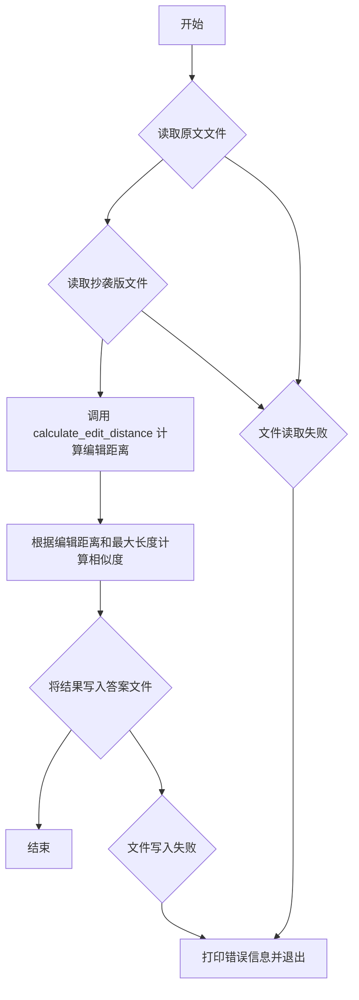
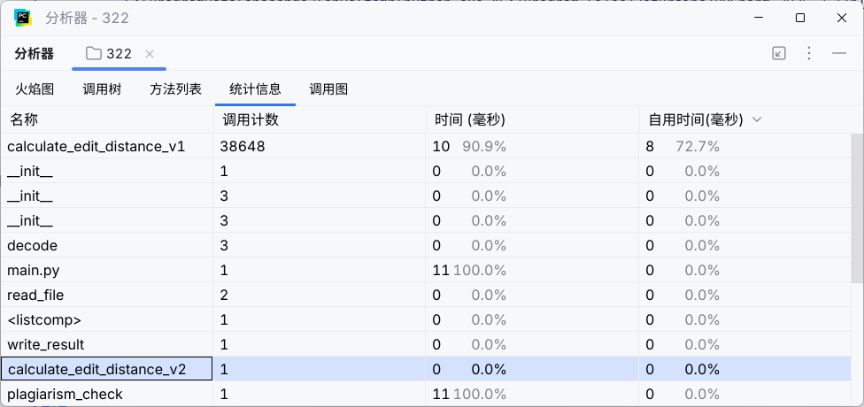
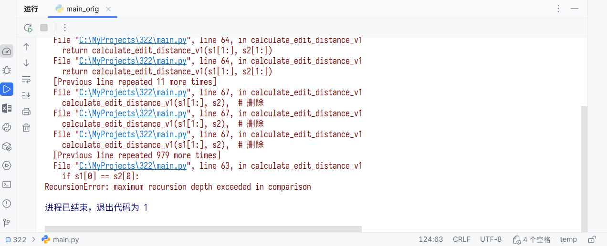
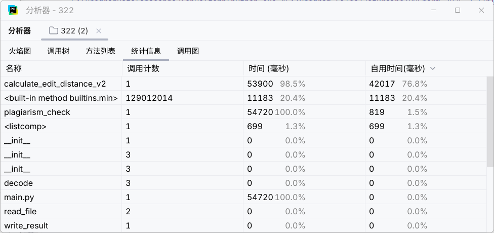

# 第一次个人编程作业

> github仓库链接：[aliyablat/3223004639](https://github.com/aliyablat/3223004639)

## 1. PSP 2.1 表格

| PSP2.1                                | Personal Software Process Stages | 预估耗时 (分钟)   | 实际耗时 (分钟) |
|---------------------------------------|----------------------------------|-------------|-----------|
| **Planning**                          | **计划**                           | **15**      |           |
| Estimate                              | 估计这个任务需要多少时间                     | (已包含在“计划”中) |           |
| **Development**                       | **开发**                           | **85**      |           |
| Analysis                              | 需求分析 (包括学习新技术)                   | 20          |           |
| Design Spec                           | 生成设计文档                           | 15          |           |
| Design Review                         | 设计复审                             | 5           |           |
| Coding Standard                       | 代码规范 (为目前的开发制定合适的规范)             | 5           |           |
| Design                                | 具体设计                             | 10          |           |
| Coding                                | 具体编码                             | 20          |           |
| Code Review                           | 代码复审                             | 5           |           |
| Test                                  | 测试 (自我测试、修改代码、提交修改)              | 5           |           |
| **Reporting**                         | **报告**                           | **20**      |           |
| Test Report                           | 测试报告                             | 10          |           |
| Size Measurement                      | 计算工作量                            | 5           |           |
| Postmortem & Process Improvement Plan | 事后总结, 并提出过程改进计划                  | 5           |           |
|                                       | **合计**                           | **120**     |           |

## 设计与实现过程

### 计算模块接口设计

- **`plagiarism_check(original_file_path: str, plagiarized_file_path: str, output_file_path: str)`**
  - **功能**: 核心业务函数，负责协调整个查重流程。
  - **参数**: 接收三个字符串参数，分别是原文路径、抄袭版论文路径和答案输出文件路径。
  - **内部流程**:
    1. 调用 `read_file` 函数分别读取原文和抄袭版论文的内容。
    2. 将读取到的文本内容传递给 `calculate_edit_distance_v1` 函数，计算它们之间的编辑距离。
    3. 根据编辑距离和文本长度计算相似度（重复率）。
    4. 调用 `write_result` 函数将计算出的相似度写入指定的输出文件。

- **`calculate_edit_distance_v1(s1: str, s2: str) -> int` 和 `calculate_edit_distance_v1(s1: str, s2: str) -> int`**
  - **功能**: 算法核心，计算两个字符串之间的编辑距离（Levenshtein 距离）。
  - **参数**: 接收两个待比较的字符串 `s1` 和 `s2`。
  - **返回值**: 返回一个整数，即编辑距离。
  - **实现**: v1 版本采用纯递归方式实现；v2 版本采用动态规划方式实现。

- **`read_file(file_path: str) -> str`** 和 **`write_result(similarity: float, output_path: str)`**
  - **功能**: 负责文件的读写操作，并包含了基本的异常处理逻辑。

### 算法原理

本项目的核心算法是**编辑距离 (Levenshtein Distance)**。编辑距离衡量的是将一个字符串转换成另一个字符串所需的最少单字符编辑（插入、删除或替换）次数。

例如，从 "cat" 到 "car"，需要替换 't' 为 'r'，编辑距离为 1。

v1版本实现采用的是一个经典的**递归**方法。其基本思想如下：
- 如果一个字符串为空，则转换代价是另一个字符串的全部长度（通过插入操作）。
- 如果两个字符串的第一个字符相同，则问题可以简化为计算剩下部分的编辑距离。
- 如果两个字符串的第一个字符不同，则我们需要考虑三种可能的编辑操作：
  1. **删除**：删除第一个字符串的首字符，然后计算剩余部分与第二个字符串的距离。
  2. **插入**：在第一个字符串前插入第二个字符串的首字符，然后计算第一个字符串与第二个字符串剩余部分的距离。
  3. **替换**：替换第一个字符串的首字符为第二个字符串的首字符，然后计算两者剩余部分的距离。
  我们取这三种操作中代价最小的一个，然后加 1（代表本次操作的代价），作为最终结果。

### 流程图

`plagiarism_check` 函数的核心流程如下：

## 性能优化

### 改进思路

v1版本的 calculate_edit_distance_v1 采用纯递归实现，其时间复杂度为指数级 O(3^n)。这导致了两个致命问题：

1. 性能雪崩：只能处理极短的文本（如short.txt），一旦文本稍长稍长，运行时间迅速增长到不可行。

2. 功能失效：处理常规文本（如8000字的orig.txt）时，会迅速超出Python的最大递归深度限制，导致程序崩溃，无法完成任务。

因此，改进的核心思路是将算法替换为时间复杂度为 O(m*n) 的动态规划实现 (v2)，使其能够处理实际应用规模的文本数据。

### 性能分析和优化结果展示

在性能对比分析时，v1和v2的性能差异是数量级上的，不存在一个合适的输入能让它们进行有意义的直接比较。

- 对于orig.txt，v1无法运行，不存在对比的基准。

- 对于short.txt，v2运行得太快，耗时几乎为零，导致性能分析无输出。

因此，我们将通过两个不同规模的测试案例，来论证本次优化的必要性和有效性。

#### 测试案例一：微型文本（short.txt）

在这个测试中，我们同时运行v1和v2版本，Profiler的统计信息如下：

分析上图可见：

- 即使是处理仅有几个字符的文本，calculate_edit_distance_v1 也消耗了 10ms 的计算时间，占总时长的 90.9%。

- 相比之下，calculate_edit_distance_v2 的耗时为 0ms，性能优势极为显著。

结论：在微型数据量下，v2的性能已远超v1。

#### 测试案例二：常规文本（orig.txt, 约8000字）

在这个测试中，v1版本因超出最大递归深度而直接失败。

我们仅对v2版本进行性能分析，结果如下：

分析上图可见：

- v2版本成功地在约 54.7秒 内完成了计算任务，证明了动态规划算法处理类似规模数据的可行性。

- calculate_edit_distance_v2 函数是程序的核心计算单元，占据了 98.5% 的运行时间。这符合预期，因为文本比对本身就是计算密集型任务。

## 单元测试

### 测试代码节选

### 测试用例设计

### 测试覆盖率截图

## 异常处理说明

### 异常设计目标

### 异常处理的单元测试样例
